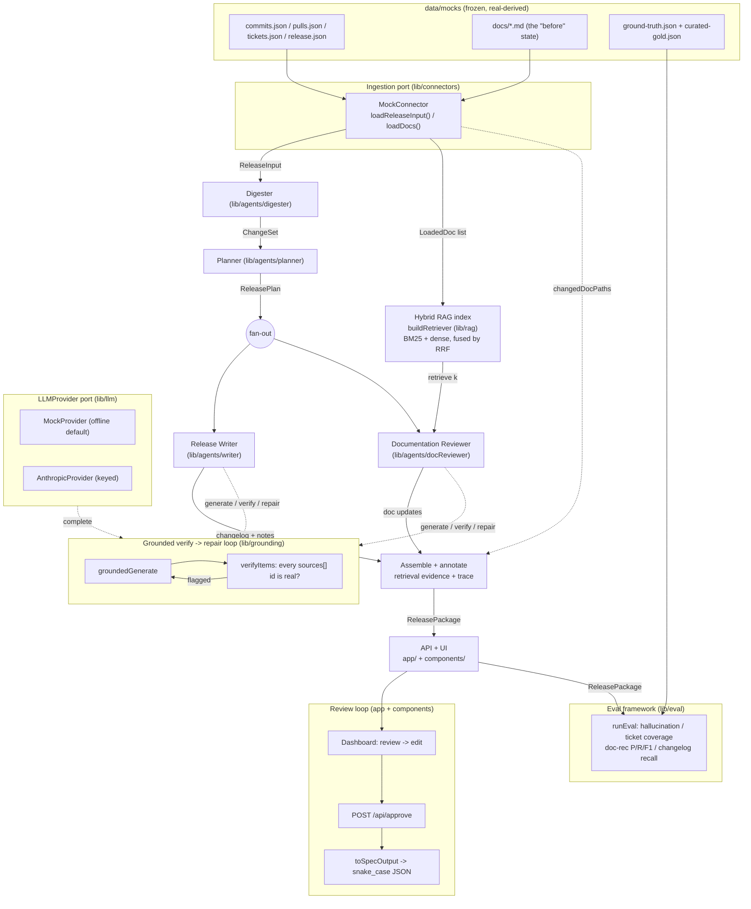

# Architecture

The Automated Release Documentation Agent turns the raw engineering artifacts of
a release window — commits, pull requests, Jira-shaped tickets, and the existing
docs — into a complete, **grounded**, reviewable release package: a categorized
changelog, internal and customer release notes, and section-level documentation
update suggestions. It runs **offline and deterministically by default** and
upgrades to abstractive generation with Claude when an API key is present, on the
*same code path*.

This document describes the *structure* of the system: the end-to-end flow, the
ports-and-adapters boundaries, every module's responsibility, and the typed
contract that ties the agents together. For the *rationale* behind these choices
(why hybrid extractive+LLM, why RRF, why a curated gold set, the eval
methodology, and the documented assumptions/limitations), see
[`DESIGN.md`](./DESIGN.md).

---

## 1. End-to-end flow

The orchestration lives in [`lib/pipeline.ts`](../lib/pipeline.ts) (`runPipeline`).
Each arrow is a **typed contract hand-off** validated against a zod schema in
[`lib/schemas/index.ts`](../lib/schemas/index.ts). The Writer and Documentation
Reviewer run concurrently (`Promise.all`) because both depend only on the
ChangeSet + ReleasePlan. Generation is wrapped in a grounded verify→repair loop;
the eval framework scores the finished package against ground truth out-of-band.



**A coordinator-owned step** in `runPipeline` (not in any single agent):

- **Observability trace.** Every stage is wall-clock timed and recorded as an
  `AgentCallTrace` carrying the active provider name, recorded in the exported
  package so a reviewer can see how the artifacts were produced and "mock vs
  anthropic" per stage.

---

## 2. Ports & adapters (hexagonal)

The system depends on **three narrow ports**, each defined as an interface and
resolved through a single factory so the concrete adapter is one swap-point. The
domain logic (agents, grounding, pipeline) never imports a concrete adapter — it
codes against the port type.

| Port | Defined in | Factory | Adapters |
|---|---|---|---|
| `Connector` | [`lib/connectors/connector.ts`](../lib/connectors/connector.ts) | `getConnector()` | `MockConnector` (reads & validates `data/mocks/` from disk) |
| `LLMProvider` | [`lib/schemas/index.ts`](../lib/schemas/index.ts) | `getProvider()` | `MockProvider` (offline) / `AnthropicProvider` (keyed) |
| `EmbeddingProvider` | [`lib/rag/embeddings.ts`](../lib/rag/embeddings.ts) | `defaultEmbeddingProvider()` / `createEmbeddingProvider()` | `HashingEmbeddingProvider` (local FNV-1a hashing) / optional `@xenova/transformers` MiniLM, env-gated by `RAG_EMBEDDINGS=transformers` |

The `LLMProvider` port lives in the **shared contract** (`lib/schemas`), not in
`lib/llm`, on purpose: every consumer — the agents *and* the grounding loop —
depends on the same boundary type and can be built and tested independently of
the concrete provider. `lib/llm/provider.ts` re-exports it for ergonomics.

### Offline-default ↔ keyed-Anthropic split (same code path)

`getProvider()` returns the real `AnthropicProvider` only when `ANTHROPIC_API_KEY`
is set and non-empty (it `.trim()`-checks, so a blank var degrades to mock);
otherwise it returns `MockProvider`. The decisive design move is that **every
agent supplies a deterministic, grounded `fallback`** (its extractive-baseline
output) on each `CompletionRequest`:

- **Offline (`MockProvider`)** re-validates that `fallback` against the request
  `schema` and returns it verbatim — the deterministic baseline *is* the output.
  No network, no key, fully reproducible (including the entire test suite).
- **Keyed (`AnthropicProvider`)** ignores the `fallback`, calls
  `claude-opus-4-8` with structured output (`output_config.format` derived from
  the zod schema via `z.toJSONSchema`), and validates the model's JSON with the
  **same** `schema.parse(...)` the mock uses.

Because both providers validate identically and both flow through the same
grounded loop, swapping providers changes *fluency*, never the contract or the
call sites. (See `lib/llm/anthropic.ts` for the Opus-4.8 request surface:
adaptive thinking, no temperature/top_p/budget_tokens, ephemeral prompt-caching
of the system prefix.)

---

## 3. Component table

One row per `lib/` module, plus `app/` and `components/`. Function names are the
actual public exports.

### `lib/`

| Module | Responsibility | Key public functions / exports |
|---|---|---|
| [`lib/schemas`](../lib/schemas/index.ts) | The single source of truth: every domain type as a zod schema, the inter-agent protocol, and the `LLMProvider`/`CompletionRequest`/`CompletionResult` port. | `ReleaseInputSchema`, `ChangeSetSchema`, `ReleasePlanSchema`, `ReleaseArtifactsSchema`, `RetrievedChunkSchema`, `ReleasePackageSchema`, `GroundTruthSchema`, `CuratedGoldSchema`, `AgentCallTraceSchema`; types `Change`, `ReleasePlan`, `ReleasePackage`, `LLMProvider`, … |
| [`lib/connectors`](../lib/connectors/connector.ts) | Ingestion port + offline adapter; reads and schema-validates `data/mocks/`. Pure helper for the incomplete-information signal. | `getConnector()`, `MockConnector` (`loadReleaseInput`, `loadDocs`, `loadGroundTruth`, `loadCuratedGold`), `findUnlinkedArtifactIds()`, `loadGroundTruth()`/`loadCuratedGold()` helpers; types `Connector`, `LoadedDoc` |
| [`lib/llm`](../lib/llm/index.ts) | LLM provider port wiring + the two adapters + trace helper. | `getProvider()`, `MockProvider`, `AnthropicProvider`, `summarize()` |
| [`lib/rag`](../lib/rag/index.ts) | Hybrid retrieval: chunk → BM25 + dense embed → RRF fusion → validated `RetrievedChunk`s. | `buildRetriever()`, `Retriever` (`create`, `index`, `retrieve`), `chunkDoc`/`chunkDocs`, `Bm25Index`, `tokenize`, `HashingEmbeddingProvider`, `defaultEmbeddingProvider`, `createEmbeddingProvider`, `cosineSimilarity`; types `Chunk`, `EmbeddingProvider`, `Retriever` |
| [`lib/grounding`](../lib/grounding/index.ts) | The faithfulness guarantee: a deterministic citation verifier + the in-loop generate→verify→repair controller. | `groundedGenerate()`, `verifyReferences()`, `verifyItems()`; types `FaithfulnessReport`, `FlaggedItem`, `ReferenceCheck` |
| [`lib/agents/digester`](../lib/agents/digester.ts) | Stage 1 — raw `ReleaseInput` → normalized, deduplicated, grounded `ChangeSet` (type inference, component inference, noise collapsing). | `digest()`, `buildDeterministicChangeSet()` |
| [`lib/agents/planner`](../lib/agents/planner.ts) | Stage 2 — `ChangeSet` → `ReleasePlan`: themes, affected systems, *explainable* risk (level + reasons), ticket-coverage accounting. | `plan()`, `buildDeterministicPlan()` |
| [`lib/agents/writer`](../lib/agents/writer.ts) | Stage 3 — `ChangeSet` + `ReleasePlan` → changelog + internal notes + customer notes (three grounded generations; customer prose is scrubbed of internal ids). | `write()` (returns `WriterOutput`) |
| [`lib/agents/docReviewer`](../lib/agents/docReviewer.ts) | Stage 4 — retrieval-driven section-level `DocUpdate[]`: query the retriever per change, pick an eligible target chunk, ground on real source ids. | `reviewDocs()` |
| [`lib/agents`](../lib/agents/index.ts) | Barrel re-exporting the four agents in execution order. | `digest`, `plan`, `write`, `reviewDocs`, `buildDeterministic*` |
| [`lib/pipeline.ts`](../lib/pipeline.ts) | The orchestration: chains the agents, builds the retriever, runs Writer ‖ Doc-Reviewer, owns the trace + retrieval evidence, validates the final `ReleasePackage`. | `runPipeline()`; type `PipelineOptions` |
| [`lib/eval`](../lib/eval/index.ts) | Out-of-band evaluation: scores a `ReleasePackage` against curated gold + harvested ground truth; CLI printer. | `runEval()`, `hallucinationRate()`, `ticketCoverage()`, `docRecommendationAccuracy()`, `changelogRecall()`, `parsePrNumber`/`parseTicketKey`, `SUBSTANTIVE_CATEGORIES`, `main()`, `formatReport()` |
| [`lib/export.ts`](../lib/export.ts) | Pure mapping from internal camelCase `ReleaseArtifacts` → the spec's snake_case output shape (preserving `sources`). | `toSpecOutput()`; type `SpecOutput` |

### `app/` (Next.js App Router)

| File | Responsibility |
|---|---|
| [`app/page.tsx`](../app/page.tsx) | Async Server Component: runs `runPipeline()` per request and hands the `ReleasePackage` to `<Dashboard>`. `force-dynamic`. |
| [`app/api/generate/route.ts`](../app/api/generate/route.ts) | `GET`/`POST` — runs the pipeline and returns the full `ReleasePackage` JSON. |
| [`app/api/approve/route.ts`](../app/api/approve/route.ts) | `POST` — re-validates a (possibly edited) package against the schema, stamps approval, returns the approved package + `toSpecOutput` export. |
| [`app/layout.tsx`](../app/layout.tsx) | Root layout + metadata. |

### `components/` (the review/approve dashboard)

| Component | Responsibility |
|---|---|
| [`Dashboard`](../components/Dashboard.tsx) | Client component owning the editable artifact draft + edit-mode state; passes values + typed `onEdit` callbacks to dumb leaf panels. The single seam between server-produced `pkg` and the UI. |
| [`ReviewBar`](../components/ReviewBar.tsx) | Sticky approve/export control surface; builds the snake_case export from the current draft via `toSpecOutput` and downloads it client-side. |
| [`ReleaseHeader`](../components/ReleaseHeader.tsx) | Minimal Release summary: project · version · tag window · change count; risk + affected systems now live inside the Internal Release Notes. |
| [`ChangelogList`](../components/ChangelogList.tsx) | Changelog grouped by category; per-entry editable text + source-evidence chip + a per-entry "N files changed" view (files linked to GitHub, resolved via `sourceIndex`). |
| [`NotesSections`](../components/NotesSections.tsx) | Internal vs customer notes in two visually distinct panels (the audience-split failure mode made obvious). |
| [`DocumentationUpdates`](../components/DocumentationUpdates.tsx) | Doc update suggestions with the resolved retrieved-chunk evidence. |
| [`SourceEvidence`](../components/SourceEvidence.tsx) | The visible face of grounding: a chip that expands to the exact `sources[]` ids (classified by `commit:`/`pr:`/`ticket:`/`chunk:`), with a loud "no sources" state. |
| [`ui.tsx`](../components/ui.tsx) | Stateless presentational primitives: `RiskBadge`, `Meter`, `CodeChip`, `Panel`. |

> Supporting (not part of the runtime): `scripts/harvest.ts` (one-time tool that
> harvests the real OSS window into `data/mocks/`) and `scripts/eval.ts` (thin
> CLI wrapper over `lib/eval`).

---

## 4. The typed-contract dataflow

### `lib/schemas` is the inter-agent protocol

Every pipeline stage consumes and produces a value **validated against a schema
in `lib/schemas`**, so the schema *is* the contract between agents and each stage
is built and tested in isolation:

```
ReleaseInput → [Digester] → ChangeSet → [Planner] → ReleasePlan
                                          ↘ (+ LoadedDoc[] → RAG)
ChangeSet + ReleasePlan → [Writer]        → changelog + internal/customer notes
ChangeSet + ReleasePlan + Retriever → [Doc-Reviewer] → DocUpdate[]
                          all of the above → ReleasePackage  (ReleasePackageSchema.parse)
```

Validation happens at every boundary, not just the edges: `MockConnector` parses
each fixture on read, the `Retriever` validates each `RetrievedChunk` on the way
out, the providers `schema.parse` model/fallback output, and `runPipeline`
re-parses the assembled `ReleasePackage`. A drift anywhere fails *loudly and
locally* rather than as an `undefined` three stages downstream.

### The grounding guarantee (every item carries source ids)

Provenance is enforced **at the type level**. A `Change.sourceIds` is
`z.array(z.string()).min(1)` — a change cannot exist without provenance — and
every generated artifact item (`ChangelogEntry`, `NoteSection`, `DocUpdate`)
carries a `sources[]` of namespaced ids (`commit:<sha>`, `pr:<number>`,
`ticket:<KEY>`). This is what makes "every claim is traceable to evidence"
checkable:

- **In the loop:** `groundedGenerate` projects each generated value down to its
  `{ sources }[]` (via the caller's `extractItems`) and runs `verifyItems`
  against the release's real id set. Any item that cites nothing or cites a
  fabricated id is flagged; the controller appends a specific repair instruction
  and re-issues the request, bounded to one repair by default. A residual failure
  is *reported in the FaithfulnessReport*, never thrown — surfaced as
  incomplete-information rather than crashing the run.
- **Offline:** the extractive baselines already cite only real ids, so the loop
  verifies once, finds nothing flagged, and returns — a clean no-op pass.
- **Out of band:** `lib/eval`'s `hallucinationRate` re-checks the same property
  on the finished package, and the UI's `SourceEvidence` chip makes it
  human-auditable.

The Planner is the one stage that uses `provider.complete` directly (no
`groundedGenerate`): its citations are *structural* (`changeIds`, ticket keys
validated by the schema), so the free-form `sources[]` verifier doesn't apply.

### The observability trace

`runPipeline` wraps each stage in a local `stage()` timer that pushes an
`AgentCallTrace` — `{ agent, provider, ms, inputSummary, outputSummary, tokens }`
— onto the package's `trace[]`. Provider name and token usage come straight from
whichever adapter ran (mock reports `tokens: null`; Anthropic reports
`usage.input_tokens`/`output_tokens`). The trace ships as data in the exported
`ReleasePackage`, recording *how* and *with which provider* every artifact was
produced — timing, active provider, and token usage per stage.

---

## See also

- [`DESIGN.md`](./DESIGN.md) — rationale, trade-offs, eval methodology, and
  documented assumptions/limitations.
- [`../data/README.md`](../data/README.md) — the frozen, real-derived fixtures
  and how they were harvested.
